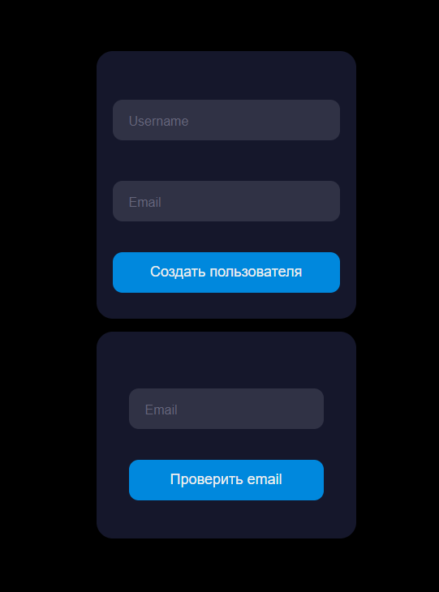

# Email Notify

## Getting Started
1. clone
> git clone https://github.com/FrigoreD/TestEmailSendler.git

2. install packages with docker
> docker-compose up --build -d

3. make and edit .env
> mv .env.example .env

4. set key, install composer and migrate tables in container

>docker exec -it TestEmailSendler_app

>composer install && npm install

>php artisan key:generate

>php artisan migrate

6. Factories

>php artisan db:seed --class=UserSeeder

7. local serve

>docker exec -it TextEmailSendler_node

>npm run dev

## Documentation

To use notify type in console
> php artisan schedule:work

### Model
model helps me to communicate with database and do it not direct but to MVC pattern

### Migrations
You can type your own table in method up with Schemma:create of Facades
it's simple to make new attributes and migrate in DB
It's usually test with Seeders to fill DB with some test values

### App

